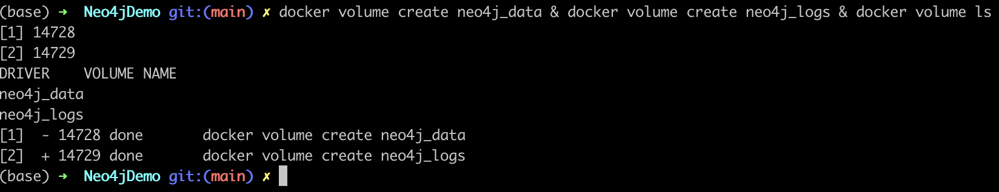
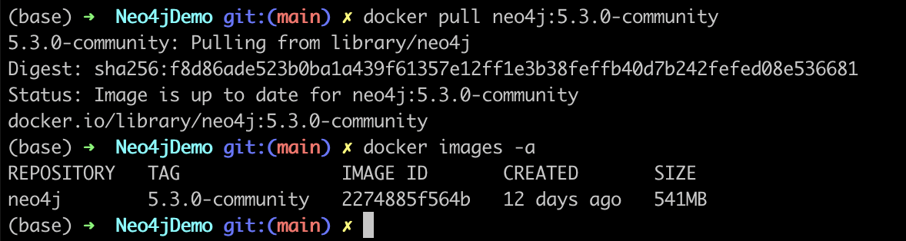
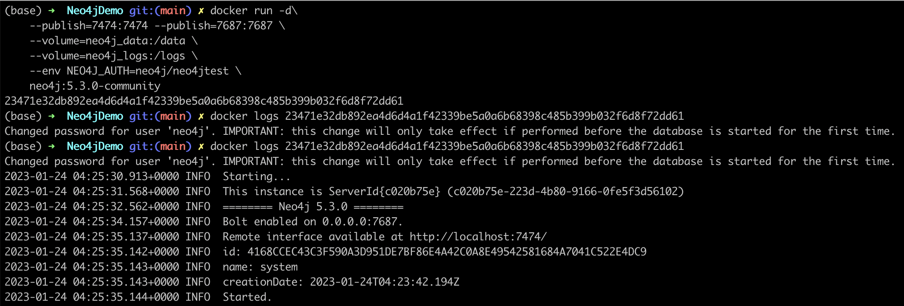
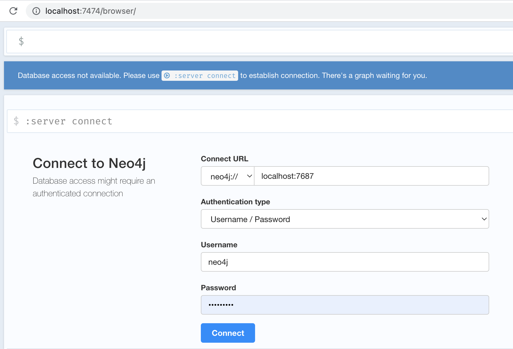
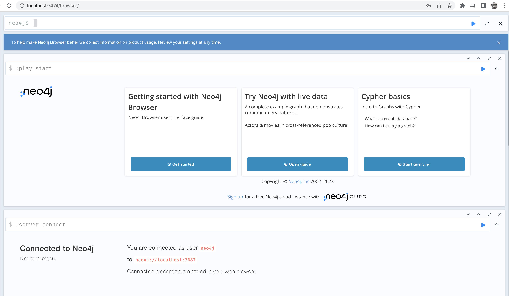
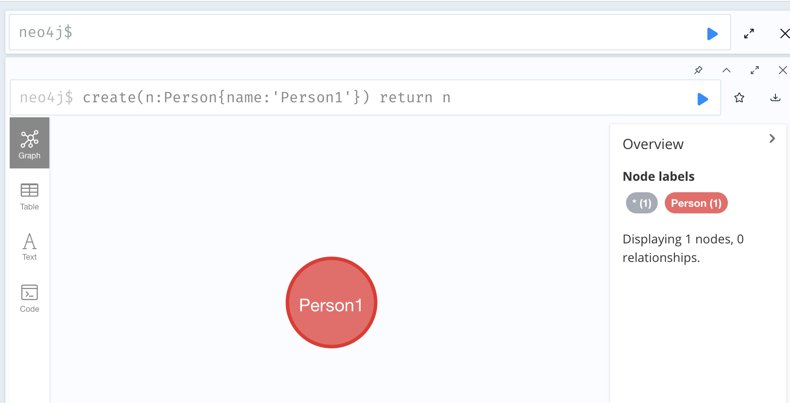
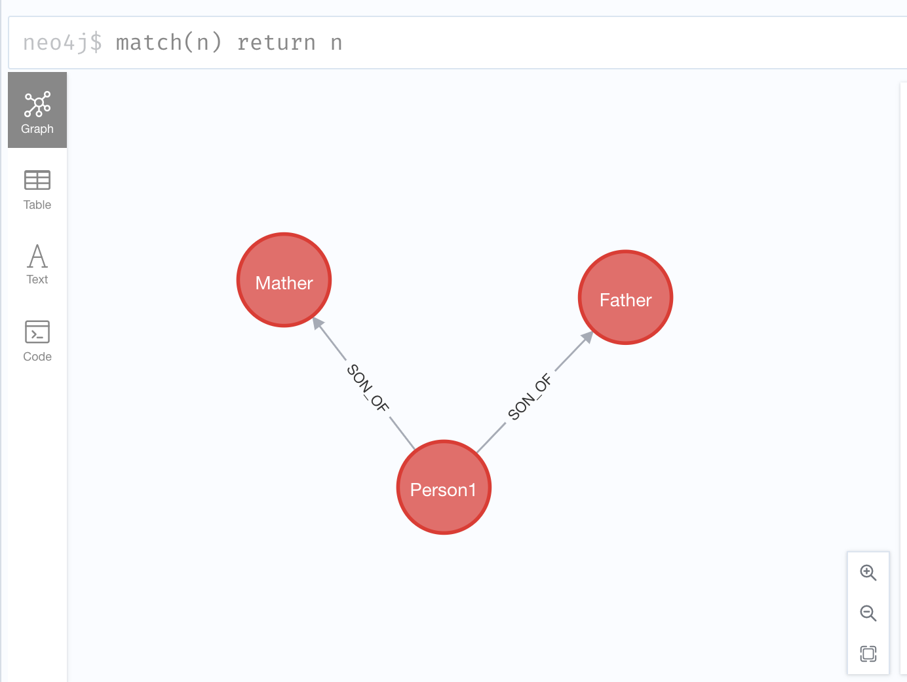
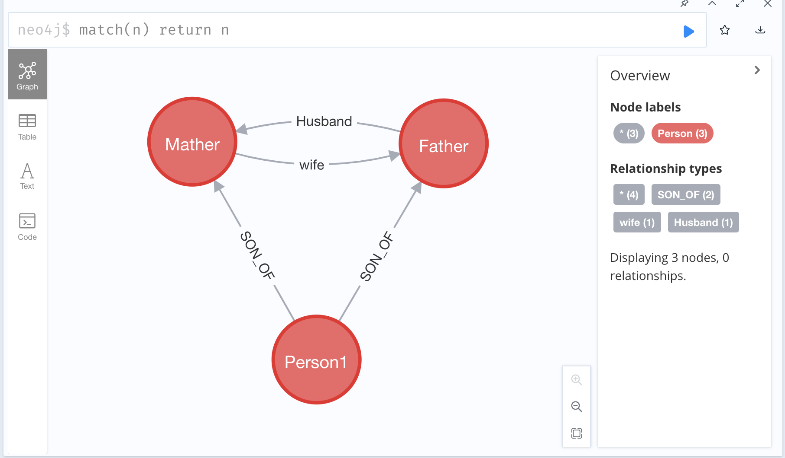

# Neo4jDemo
For Beginner Study Neo4j 

## 1. Prerequisite
- install docker
- install JDK

## 1.1 create docker local volume
```shell
docker volume create neo4j_data & docker volume create neo4j_logs & docker volume ls
```


## 2. Install Neo4j
### 2.1 download Neo4j Community version from docker hub
```shell
docker pull neo4j:5.3.0-community
```


*Note: recommend download specify version for later environment setup*

### 2.2 Start up Neo4j
```shell
mkdir data & docker run -d\
    --publish=7474:7474 --publish=7687:7687 \
    --volume=neo4j_data:/data \
    --volume=neo4j_logs:/logs \
    --env NEO4J_AUTH=neo4j/neo4jtest \
    neo4j:5.3.0-community
```

*Note: docker command params*
- *-d: which sending current docker process to background*
- *--publish: which mapping container port 7474, 7687 to local machine*
- *--volume: mount docker volume into container*
- *--env NEO4J_AUTH setting neo4j auth environment. here reset neo4j default username & password to **neo4j/neo4jtest***
### 2.3 Access Neo4j and login with neo4j/neo4jtest
[http://localhost:7474](http://localhost:7474)

```text
which allows you to access neo4j through your browser at http://localhost:7474.

This binds two ports (7474 and 7687) for HTTP and Bolt access to the Neo4j API. A volume is bound to /data to allow the database to be persisted outside the container.

By default, this requires you to login with neo4j/neo4j and change the password. For development purposes, disable authentication by passing --env=NEO4J_AUTH=none to docker run.
```


*Noted: Enter username (neo4j) and password (neo4jtest) and click Connect*
### 2.4 Success Login Neo4j


## 3 Create Neo4j Nodes
### 3.1 Create first Node 
- Node type: Person
- Node label: name: Person1
```java
create(n:Person{name:'Person1'}) return n
```


### 3.2 Create Person Parents Node
- Node type: Person
- Node label: name: Father / Mater
```java
create(n:Person{name:'Father'}) return n
create(n:Person{name:'Mather'}) return n
```
### 3.3 Query all nodes
we can see all 3 nodes are created in Neo4j


### 3.4 Create relationships
**Create Father and Son Relationship**
```java
MATCH(n:Person), (p:Person)
where n.name='Father' AND p.name='Person1'
create (p)-[child:SON_OF]->(n)
```
**Create Materh and Son Relationship**
```java
MATCH(n:Person), (p:Person)
where n.name='Mather' AND p.name='Person1'
create (p)-[child:SON_OF]->(n)
```
**Verify Result**

***Create Father and Mather Relationship**
```java
MATCH(n:Person), (p:Person)
where n.name='Mather' AND p.name='Father'
create (n)-[COUPLE:wife]->(p)
```

```java
MATCH(n:Person), (p:Person)
where n.name='Mather' AND p.name='Father'
create (p)-[COUPLE:Husband]->(n)
```
**Verify Result**


Until now, we have built up the simple parent and child relationship. 