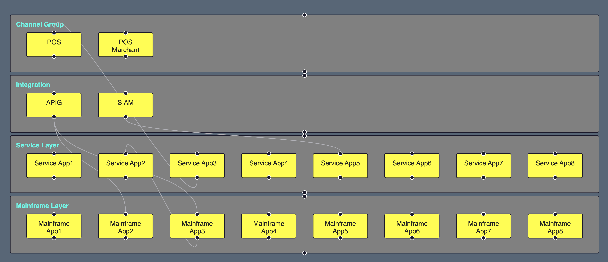
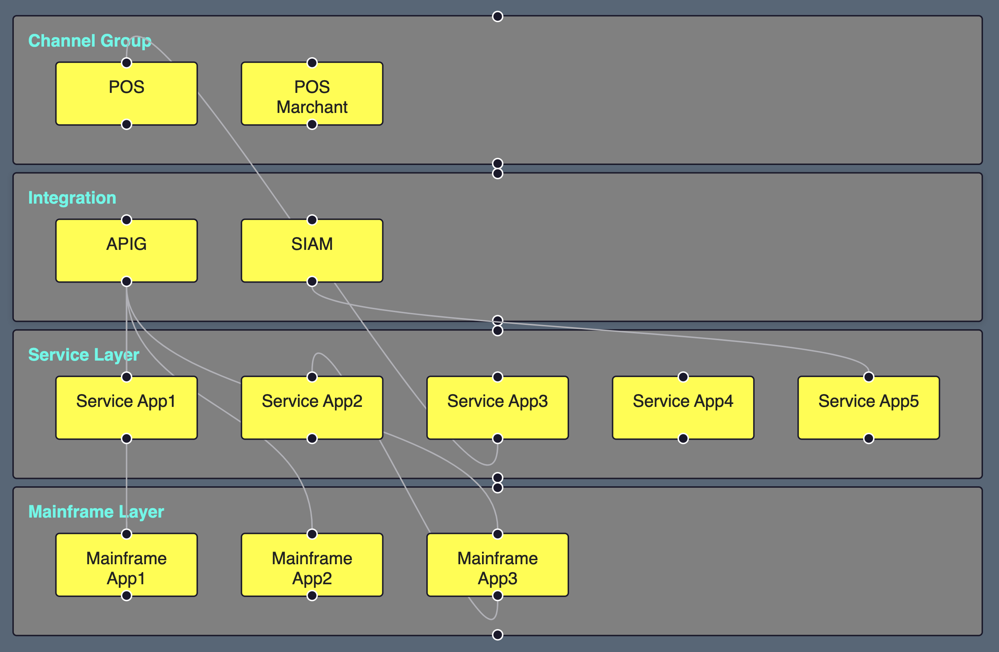

## Input data
```json
export const SWIMLANE_GROUP_NODES = [
  {
    id: "1",
    name: "Channel Group",
    children: [
      {
        id: "11",
        name: "POS"
      },
      {
        id: "12",
        name: "POS Marchant"
      }
    ]
  },
  {
    id: "2",
    name: "Integration",
    children: [
      {
        id: "21",
        name: "APIG"
      },
      {
        id: "22",
        name: "SIAM"
      }
    ]
  },
  {
    id: "3",
    name: "Service Layer",
    children: [
      {
        id: "31",
        name: "Service App1"
      },
      {
        id: "32",
        name: "Service App2"
      },
      {
        id: "33",
        name: "Service App3"
      },
      {
        id: "34",
        name: "Service App4"
      },
      {
        id: "35",
        name: "Service App5"
      },
      {
        id: "36",
        name: "Service App6"
      },
      {
        id: "37",
        name: "Service App7"
      },
      {
        id: "38",
        name: "Service App8"
      }
    ]
  },
  {
    id: "4",
    name: "Mainframe Layer",
    children: [
      {
        id: "41",
        name: "Mainframe App1"
      },
      {
        id: "42",
        name: "Mainframe App2"
      },
      {
        id: "43",
        name: "Mainframe App3"
      },
      {
        id: "44",
        name: "Mainframe App4"
      },
      {
        id: "45",
        name: "Mainframe App5"
      },
      {
        id: "46",
        name: "Mainframe App6"
      },
      {
        id: "47",
        name: "Mainframe App7"
      },
      {
        id: "48",
        name: "Mainframe App8"
      }
    ]
  }
];
```

## Algorithm Output Sample 1


## Algorithm Output Sample 2
